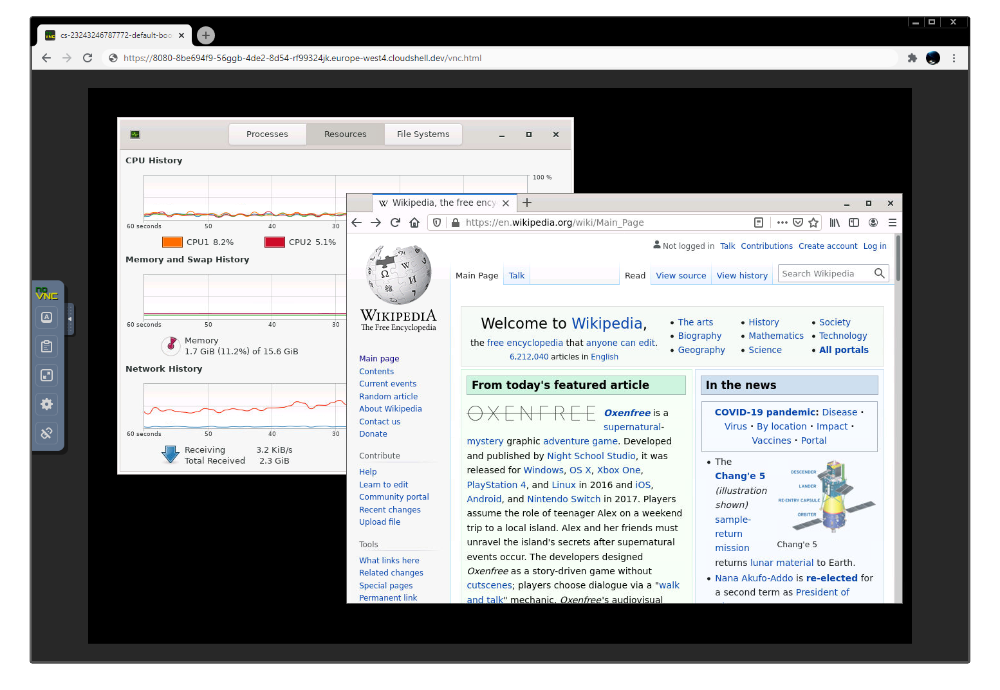

Cloudshell VNC
===

This utility is intended to make it easy to run X11 GUI apps on Google's Cloud Shell Editor. 

What it includes?
------------
This will install a bare-bones desktop environment, powered by Openbox. Of course, you can install any GUI apps you like using `apt`, and you can run them from either Cloud Shell Editor itself or from a graphical X terminal/launcher.

Installation
------------
As Google's Cloud Shell Editor containers are ephemeral, you have to run `install.sh` everytime yours resets. The installation is fast, so no big hassle here: 

    ./install.sh

Running
-------
The install script creates a symlink in one of the `bin` directories, as such, running it is easy:

    your-prompt@cloudshell:~$ cs-vnc
    
Running options
-------
    cs-vnc -h
    Usage: cs-vnc <args>
       -h          Print this message
       -f          Run in the foreground
       -k          Kill running daemon

If there are no arguments provided, `cs-vnc` runs as a daemon by default.